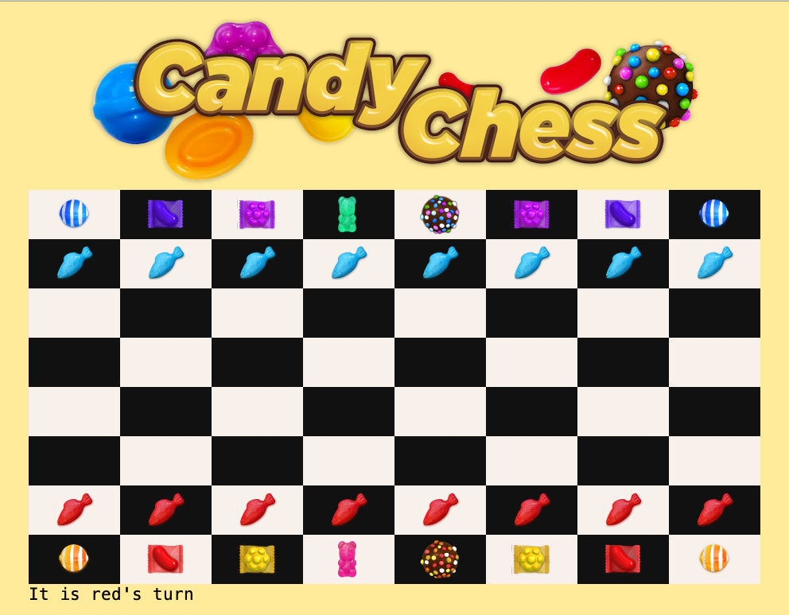
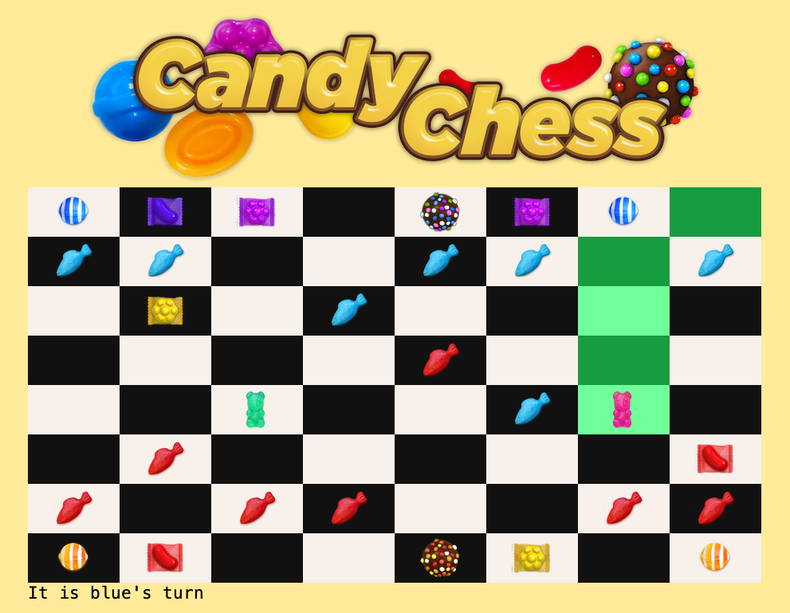
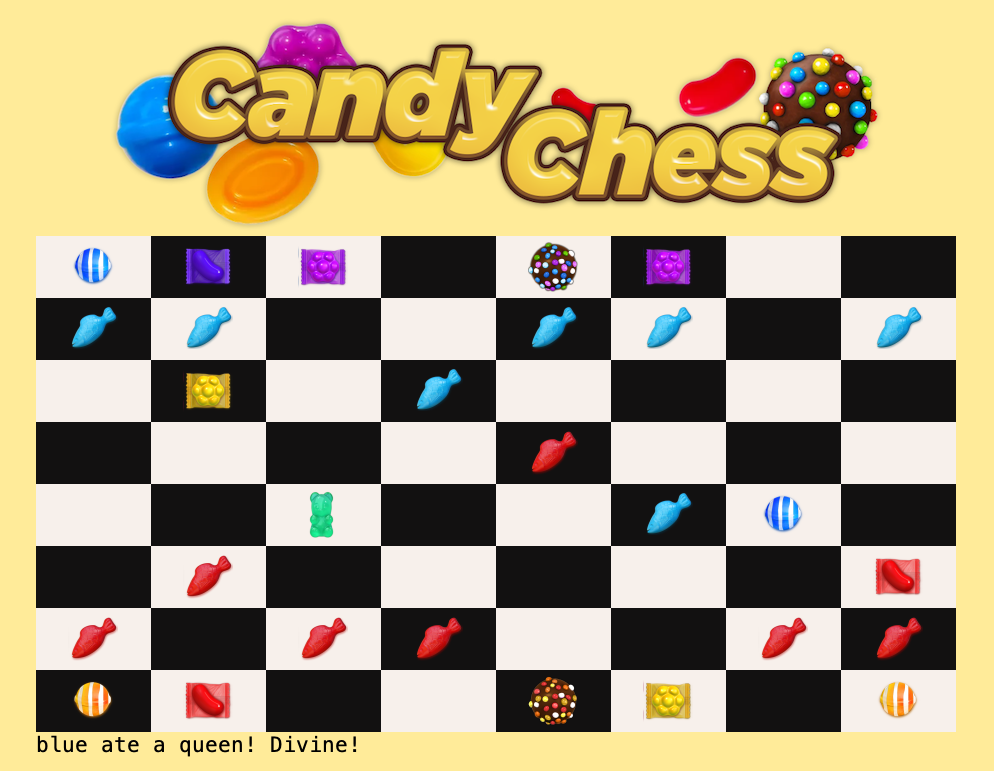
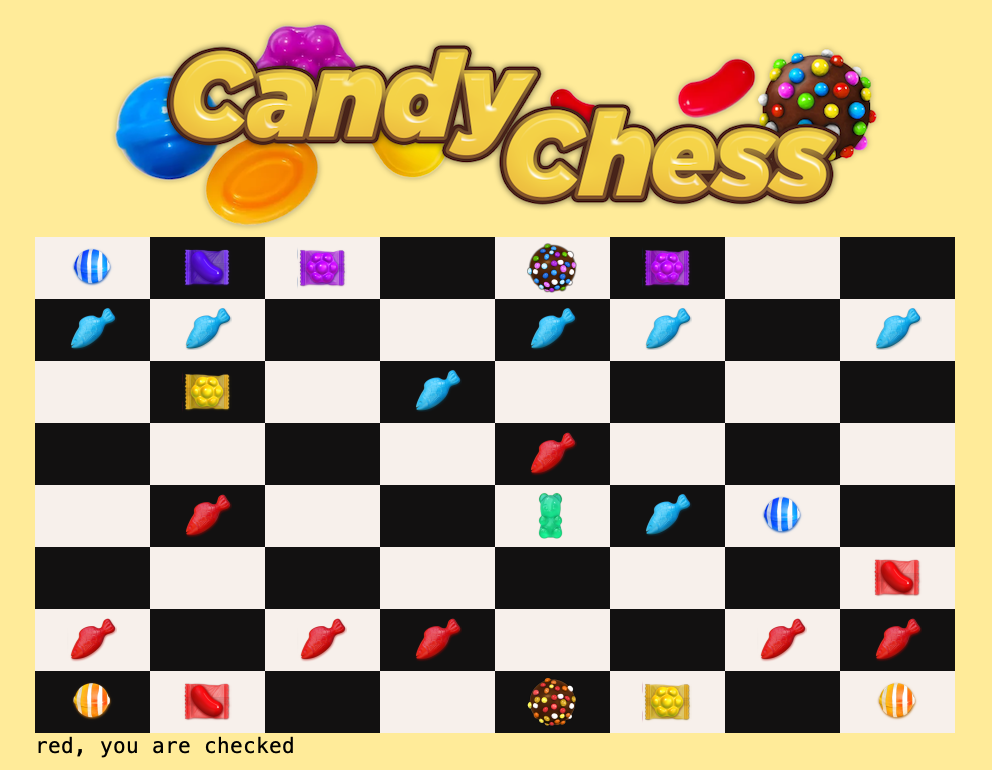
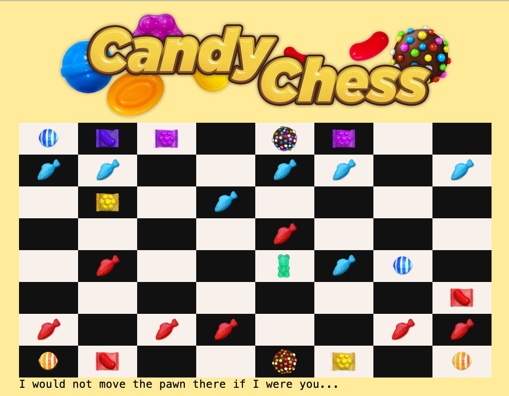
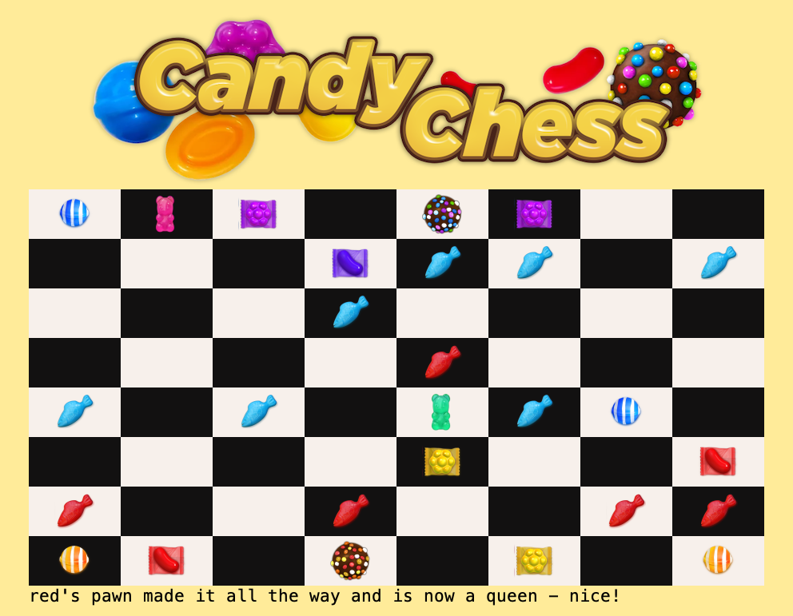
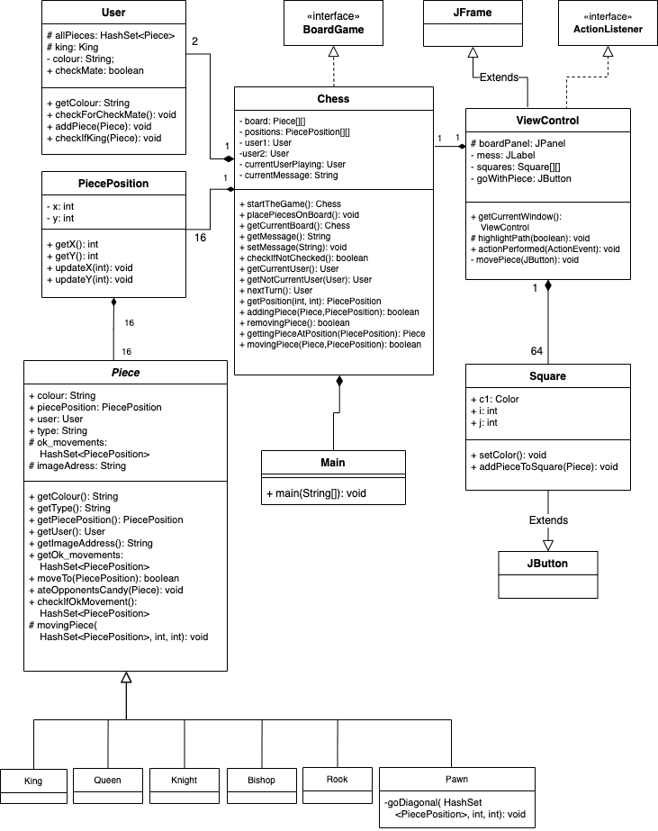

# CandyChess
A java based game where Chess meets Candy Crush, built as a part of the course DD1385 Software Engineering. On this smart 
game board two users can play, and the program keeps track of who's turn it is, where it is ok to move pieces, when there is check mate or when the king is in danger.

Initial setup of game. The message at the bottom keeps track of who's turn it is.

_When clicking a piece, possible positions to go to lights up as green on the board. The user can not choose any position other than these_

When one of opponents pieces has been eaten - the message field will update what just happened. Followed by a randomly generated word from the Candy Crush dictionary, such as Divine! Tasty! or why not, Sugar Crushing it!

The game keeps track of when a player has been checked. Yep, that multi-colored sugar sprinkled chocolate ball is indeed the king.

And will not let the user make any silly moves when their Candy King is in danger.

If a brave Candy Fish, also known as a pawn, makes it all the other way to the other side of the board, it will turn into a juicy gummy bear - also known as a queen.

##  Project Structure

#### Game Logic:
* The main game logic takes place in the Chess class. This class also implements the BoardGame interface. 
* The abstract class Piece, contains all the logic for all the different chess pieces.
* The classes King, Queen, Knight, Bishop, Rook and Pawn then extends the Piece class. The Pawn also has it's own special move class, for the special move-logic that comes with being a pawn.
* The class PiecePosition knows everything about a certain position on the board. 
* The User class handles all the logic regarding the two users playing the game. Such as what color they are, what pieces they have left, and if the are checked.
#### View:
* The class ViewControl takes care of the front-end. It extends JFrame and implements the interface ActionListener. When initialized, it creates a JFrame with an JPanel and adds 64 objects of the Square class to it.
* The class Square is our second, very important, front-end class. It extends JButton, and keeps track of the front-end for a specific square on the board. Such as, what color the square is, and if it should display an image of a candy piece.

#### UML Diagram

